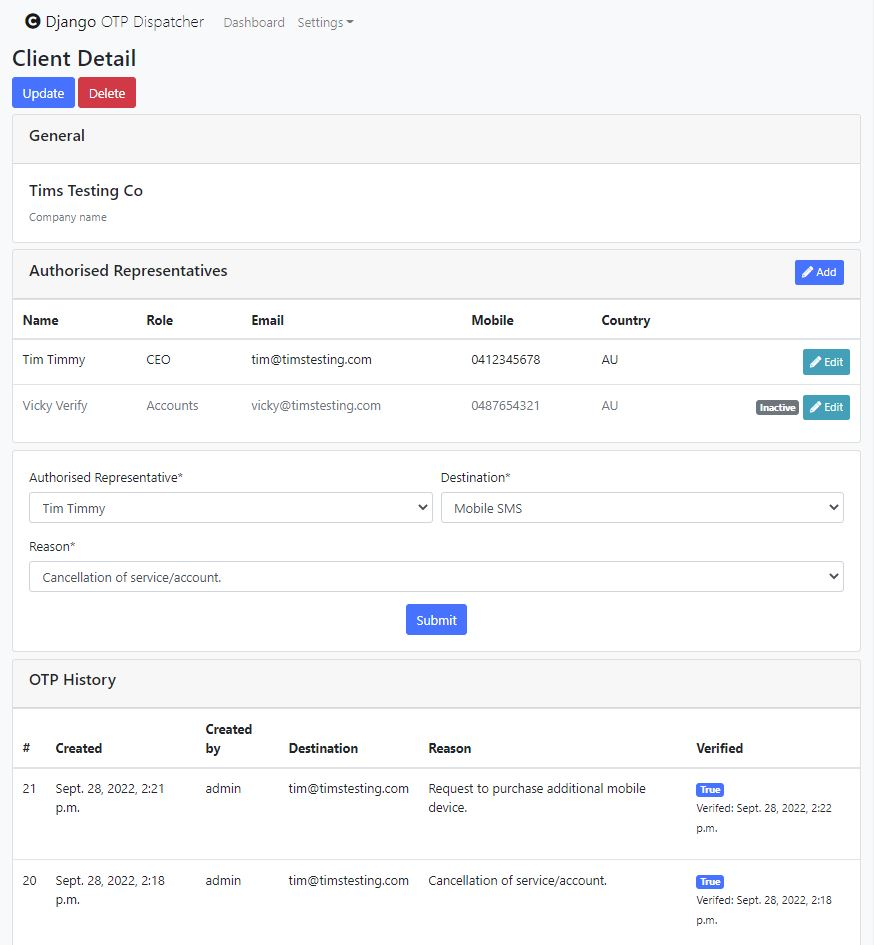

#  Django-OTP-Dispatch-Portal

##### A One Time Password dispatching tool built on Django and Amazon Web Services.

## Table of contents
* [Introduction](#Introduction)
* [Features](#Features)
* [Sources, technologies and dependencies](#Sources-technologies-and-dependencies)
* [Setup](#Setup)
* [Instructions](#Instructions)
* [Credits](#Credits)
* [License](#License)

## Introduction
Django OTP Dispatch Portal was developed in response to a change in telecommunication standards within Australia. 
Specifically the tightening of acceptable customer authentication methods 
when porting mobile numbers to a new provider with the aim of protecting against unauthorised 'SIM swaps'.

In order to meet these new requirements customers would need to be sent a 
unique one time passcode (OTP), this code would need to be 
validated before any work could take place and finally records of the authentication need to be kept.

## Features
* Portal user authentication
  * Login / Logout
  * Password reset
  * Login required views
* One time unique passcode creation
* Dispatch SMS to any country.
* Mobile number validation - ensuring the number provided matches country requirements.
* One time passcode validation.
  * Three attempts or 5 minutes until OTP marked invalid.
* Records of all passcodes dispatch stored within database.

## Sources, technologies and dependencies
* [Django](https://www.djangoproject.com/)
* [SQLite](https://sqlite.org/index.html)
* [python-decouple](https://github.com/henriquebastos/python-decouple)
* [django-bootstrap4](https://github.com/zostera/django-bootstrap4)
* [django-crispy-forms](https://github.com/django-crispy-forms/django-crispy-forms)
* [phonenumbers Python Library](https://github.com/daviddrysdale/python-phonenumbers)
* [pycountry](https://github.com/flyingcircusio/pycountry)
* [django-bootstrap-datepicker](https://github.com/pbucher/django-bootstrap-datepicker)
* [Boto3 (Python AWS SDK)](https://boto3.amazonaws.com/v1/documentation/api/latest/index.html)
* [Amazon Simple Notification Service](https://aws.amazon.com/sns/?whats-new-cards.sort-by=item.additionalFields.postDateTime&whats-new-cards.sort-order=desc)

## Setup
Installing to a production environment is outside the scope of this work. 

To install locally follow the below steps.

1. [Clone](https://github.com/git-guides/git-clone) 'Django-OTP-Dispatch-Portal' to your local machine and navigate to the project directory from the command line where you'll find 'requirments.txt'.
2. Create and run a virtual environment in your projects main directory where you'll find 'requirements.txt'.
   1. Via the CLI follow [these](https://docs.python.org/3/tutorial/venv.html) steps.
   2. Via PyCharm follow [these](https://www.jetbrains.com/help/pycharm/creating-virtual-environment.html) steps. 
3. Install dependencies - Navigate to your projects main directory where you'll find 'requirements.txt' and run `pip install -r requirements.txt`
4. Create your settings repository - Navigate to your projects main directory where you'll find 'env.example'. Copy the file and rename as '.env'
5. Update your settings repository '.env' making sure to change the below values at a minimum *note you will require an active AWS account*:
   1. `SECRET_KEY = ENTER-VALUE-HERE` 
   2. `DB_NAME = ENTER-VALUE-HERE`
   3. `DB_USER = ENTER-VALUE-HERE`
   4. `DB_PASSWORD = ENTER-VALUE-HERE`
   5. `TIME_ZONE = ENTER-VALUE-HERE` [Django timezones](https://docs.djangoproject.com/en/3.2/topics/i18n/timezones/)
   6. `AWS_ACCESS_KEY_ID = ENTER-VALUE-HERE`
   7. `AWS_SECRET_ACCESS_KEY = ENTER-VALUE-HERE`
   8. `AWS_REGION = ENTER-VALUE-HERE`
6. Modify line 53 of the 'otp_dispatcher' view.py file. Setting it to your desired SMS sender name.
7. Follow the [Amazon SNS guide](https://docs.aws.amazon.com/sns/latest/dg/sns-getting-started.html)
to create an SNS topic to be used in conjunction with Django-OTP-Dispatch-Portal. 

## Instructions
Once your project has been set up you can start the Django development server by following the below.
1. Start your virtual environment.
2. Navigate to Django's base directory which contains the 'manage.py' file.
3. Run `python manage.py migrate` to create the Django's default database structure.
4. Run `python manage.py createsuperuser` to create your super/first user.
5. Run `python manage.py runserver` to start the development server.
6. Open your web browser and head to `http://127.0.0.1:8000/` as show in the CLI.
7. Log in using the superuser credentials you created.
8. To send an SMS simply enter the recipients mobile number and select the appropriate country. 
   1. Should the number provided not meet the country requirements an error message will display.
9. Upon successfully sending your OTP code you'll be directed to the verification page.
   1. Each code expires five minutes from dispatch
   2. Each code expires after three failed attempts to verify.
10. Records of successful, failed and skipped codes can be located on the dashboard.

## Credits
Sincerest thanks to the contributors of [phonenumbers Python Library](https://github.com/daviddrysdale/python-phonenumbers) and 
[pycountry](https://github.com/flyingcircusio/pycountry) for their amazing work!

